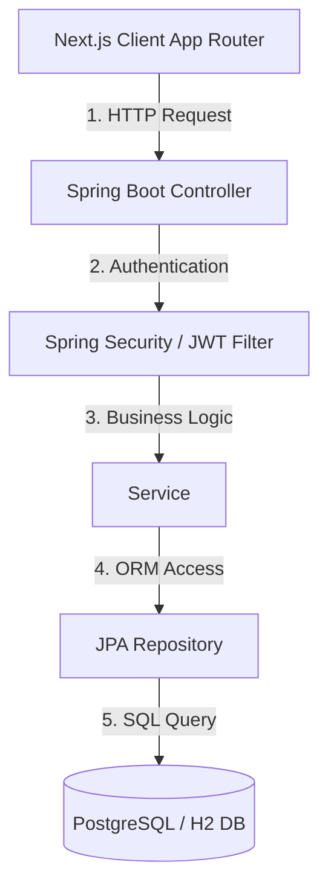

## **게시판**

RESTful API 기반 사용자 인증(JWT), 게시글 CRUD, 반응형 UI 및 에러 핸들링을 구현한 프로젝트입니다.

---

## 1. 프로젝트 요약

- **개발 기간:** 2026.07.25 ~ 2026.08.02 (약 1주)
- **개발 인원:** 개인 프로젝트
- **주요 기능:**
    - JWT 기반 회원가입 / 로그인 인증 시스템
    - 게시글 작성 · 수정 · 삭제 · 목록 조회
    - 계층형 댓글 & 대댓글 작성 · 수정 · 삭제
    - 실시간 알림
- **프로젝트 목표:** 백엔드/프론트엔드 간 스펙 정합성 유지 및 예외 처리, 사용자 경험(UX) 최적화

---

## 2. 배포 및 결과물

| 기능 분류          | 설명                                                   | 시연 이미지                                                                       |
| -------------- | ---------------------------------------------------- | ---------------------------------------------------------------------------- |
| **로그인 / 회원가입** | • 이메일/비밀번호 기반 회원가입 및 로그인 • 입력값 유효성 검사 및 폼 에러 처리   |  |
| **게시글 CRUD**   | • 게시글 작성, 수정, 삭제 및 상세 조회                          |        |
| **댓글 CRUD**    | • 실시간 댓글/답글 작성, 수정, 삭제 • 내 게시글에 댓글 작성 시 실시간 알림 수신 |      |
| **알림**         | • 내 게시글에 댓글 작성 시 실시간 알림 수신                           |      |

---

## 3. 트러블슈팅 및 문제 해결 경험

### 사례 1. CORS Preflight 요청 시 401 오류 발생

- **문제 상황:** 프론트엔드에서 헤더에 Authorization을 붙여 요청할 때, CORS 에러가 발생하며 서버에서 401/403 에러가 반환됨.
- **원인 분석:** 브라우저가 실제 요청을 보내기 전 예비 요청인 OPTIONS 메서드를 보내는데, Security Filter Chain에서 OPTIONS 요청에도 JWT 검증을 시도하다가 토큰이 없어 예외가 발생함.
- **해결 방법:** JwtAuthenticationFilter 상단에 조건문을 추가하여 Preflight 요청은 JWT 검사 없이 다음 필터로 진행하도록 패스 처리함.

### 사례 2. @Transactional(readOnly = true) 미적용으로 인한 불필요한 메모리 사용 발생

- **문제 상황:** 단순 게시글 조회 API 요청이 몰릴 때 서버의 CPU 사용량과 메모리가 급격히 증가함.
- **원인 분석:** 읽기 전용 API임에도 일반 @Transactional이 적용되어 JPA가 엔티티의 스냅샷을 생성하고 메모리에 유지하며 비효율적으로 Dirty Checking을 수행함.
- **해결 방법:** 조회 전용 서비스 메서드에 readOnly = true를 선언하여 스냅샷 생성을 차단하고, DB Read Replica로 읽기 트래픽을 분산할 수 있도록 함

### 사례 3. 부모 댓글 완전 삭제 시 자식 댓글도 사라지는 문제 발생

- **문제 상황:** 부모 댓글을 삭제하자 밑에 달려있던 대댓글들까지 한꺼번에 DB에서 삭제됨.
- **원인 분석:** CascadeType.REMOVE 설정으로 인해 자식 데이터가 강제 삭제됨.
- **해결 방법:** 자식 댓글이 있는 부모 댓글 삭제 시, DB에서 인스턴스를 삭제하지 않고 상태만 변경하는 Soft Delete 방식을 채택함.

---

## 4. 성능 최적화 경험

### 사례 1. Offset 기반 페이징의 성능 저하

- **문제 상황:** 10,000번째 페이지를 조회할 때 DB 조회 속도가 심각하게 느려짐.
- **원인 분석:** DB는 앞선 n개의 행을 읽은 뒤 버리고 10개만 가져와서, 뒤쪽 페이지로 갈수록 I/O 비용이 비례하여 증가함.
- **해결 방법:** Cursor 기반 페이징으로 전환하여 성능을 $O(1)$ 수준으로 최적화함

### 사례 2. 검색 쿼리 사용 시 인덱스 타지 않는 문제

- **문제 상황:** 게시글 제목 검색 기능 추가 후 데이터가 많은 경우 검색 API 응답 속도가 급격히 떨어짐.
- **원인 분석:** LIKE '%keyword%' 와 같이 와일드카드가 앞에 오는 쿼리는 B-Tree 인덱스를 타지 못하고 Full Table Scan을 실행함.
- **해결 방법:** 일부 키워드는 일치하도록 수정하여 인덱스를 탈 수 있도록 변경

---

## 5. 기술 스택

| 구분           | 기술 스택                                                | 선택 이유                                                  |
| ------------ | ---------------------------------------------------- | ------------------------------------------------------ |
| **Frontend** | Next.js 15 (App Router), TypeScript, Tailwind CSS v4 | SSR/CSR 조합을 통한 성능 최적화, 정적 타입 검사로 컴파일 타임 에러 방지          |
| **Backend**  | Java 17, Spring Boot 3, Spring Security              | 안정적인 비즈니스 로직 처리 및 Spring Security를 활용한 보장된 보안 프레임워크 적용 |
| **Database** | H2 (Dev) / Postgresql (Prod), Spring Data JPA        | 개발/운영 환경 분리, ORM을 통한 데이터베이스 독립성 및 개발 생산성 확보            |
| **Auth**     | JWT (JSON Web Token)                                 | 서버 세션 부하를 줄이고 확장성을 고려한 Stateless 인증 방식 채택              |

---

## 6. 시스템 아키텍처 및 데이터 흐름

## 7. API 명세서

### 인증

| 요청 메서드 | 엔드포인트          | 기능 설명           |
| ------ | -------------- | --------------- |
| `POST` | `/auth/signup` | 회원가입            |
| `POST` | `/auth/login`  | 로그인 및 JWT 토큰 발급 |

### 게시글

| 요청 메서드   | 엔드포인트         | 기능 설명     |
| -------- | ------------- | --------- |
| `GET`    | `/posts`      | 게시글 목록 조회 |
| `GET`    | `/posts/{id}` | 게시글 상세 조회 |
| `POST`   | `/posts`      | 신규 게시글 작성 |
| `PATCH`  | `/posts/{id}` | 게시글 수정    |
| `DELETE` | `/posts/{id}` | 게시글 삭제    |

### 댓글

| 요청 메서드   | 엔드포인트                      | 기능 설명            |
| -------- | -------------------------- | ---------------- |
| `GET`    | `/posts/{postId}/comments` | 특정 게시글의 댓글 목록 조회 |
| `POST`   | `/posts/{postId}/comments` | 댓글 작성            |
| `PATCH`  | `/comments/{id}`           | 댓글 수정            |
| `DELETE` | `/comments/{id}`           | 댓글 삭제            |

### 알림

| 요청 메서드   | 엔드포인트                      | 기능 설명      |
| -------- | -------------------------- | ---------- |
| `GET`    | `/notifications`           | 내 알림 목록 조회 |
| `PATCH`  | `/notifications/{id}/read` | 알림 읽음 처리   |
| `DELETE` | `/notifications/{id}`      | 알림 삭제      |

---

## 8. 향후 개선 계획 및 배운 점

### 개선 계획

- 좋아요/추천
- 다크모드

### 배운 점

- **JPA 내부 메커니즘 이해 및 데이터 조회/삭제 최적화**
    - JPA의 내부 동작 방식을 이해할 수 있었습니다.
    - 개발 과정에서 불필요한 메모리 사용을 줄이고, 데이터 무결성과 성능을 함께 고민해 보았습니다.
- **DB 인덱스와 쿼리 성능 개선**
    - Full Table Scan이 발생하는 문제를 겪으며, DB 인덱스 구조와 실행 계획의 중요성을 체감했습니다.
- **Spring Security와 JWT 인증 및 보안 아키텍처 구축**
    - Security Filter Chain의 흐름을 이해하고 JWT 기반의 Stateless 인증을 구현했습니다.
    - CORS Preflight(OPTIONS) 요청과 필터 처리 순서 간의 충돌 문제를 직접 해결하며 보안 필터의 동작 원리를 명확히 파악했습니다.
